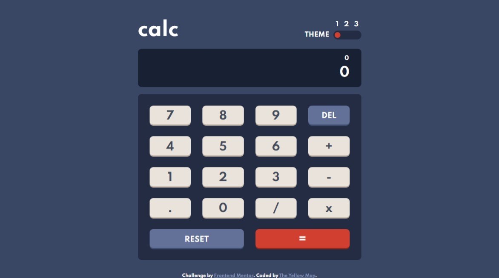

# Frontend Mentor - Calculator app solution

This is a solution to the [Calculator app challenge on Frontend Mentor](https://www.frontendmentor.io/challenges/calculator-app-9lteq5N29). Frontend Mentor challenges help you improve your coding skills by building realistic projects.

## Table of contents

-   [Overview](#overview)
    -   [The challenge](#the-challenge)
    -   [Screenshot](#screenshot)
    -   [Links](#links)
-   [My process](#my-process)
    -   [Built with](#built-with)
    -   [What I learned](#what-i-learned)
    -   [Continued development](#continued-development)
-   [Author](#author)
-   [Acknowledgments](#acknowledgments)

**Note: Delete this note and update the table of contents based on what sections you keep.**

## Overview

### The challenge

Users should be able to:

-   See the size of the elements adjust based on their device's screen size
-   Perform mathmatical operations like addition, subtraction, multiplication, and division
-   Adjust the color theme based on their preference

### Screenshot



### Links

-   Live Site URL: [Live Site](https://your-live-site-url.com)

## My process

### Built with

-   Semantic HTML5 markup
-   Sass
-   Flexbox
-   CSS Grid
-   Mobile-first workflow
-   Typescript

### What I learned

I learnt how to style Input[type=range] elements

```scss
input[type="range"] {
	appearance: none;
	// new stylings

	&::-webkit-slider-thumb {
		appearance: none;
		// new stylings
	}
}
```

I learnt how to grab the Event.target.value from HTML elements using typescript

```ts
const handleAction(e) => {
  const target = e.target as HTMLInputElement
  // Change HTMLInputElement depending on your Element type
  const value = target.value
  // ...run code
}
```

### Continued development

In the near future i would like to expand the functionalities of the application, if possible transferring it to a [ReactJS](https://www.reactjs.org) project
As well as implementing some kind of state management like [Context Api Hook](https://reactjs.org/docs/context.html) or [Redux](https://www.reduxjs.org)

## Author

-   Website - [The Yellow May](https://yellow-may.vercel.app/)
-   Frontend Mentor - [@Yellow-May](https://www.frontendmentor.io/profile/Yellow-May)
-   Linkedin - [Precious Onyekwere](https://www.linkedin.com/in/precious-onyekwere-7a87001b5/)

## Acknowledgments

Big help from [Freshmen](https://freshman.tech/snippets/typescript/fix-value-not-exist-eventtarget/) which helped in learning more about Typescript, also styling help from [Css-Tricks](https://www.css-tricks.com)
